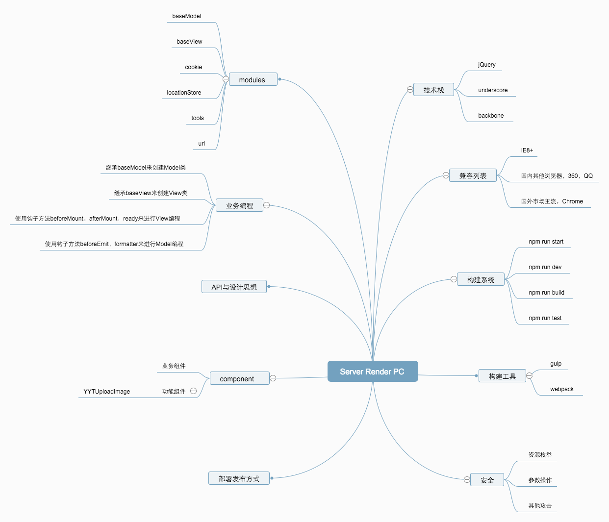
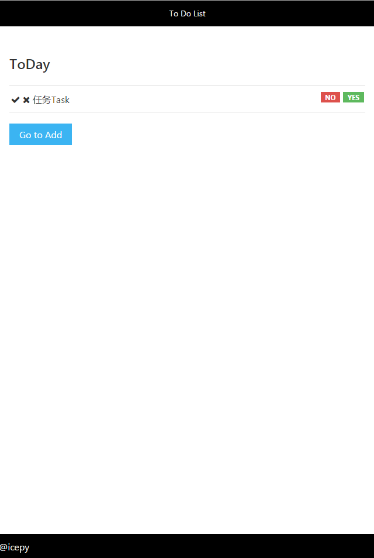

#generate-backbone-pc

**适用范围**

此脚手架既适用于客户端渲染也适用于Server Render（JSP）项目，项目内虽然采用了模块化，以及MVC分层，但使用的技术已经比较老旧（因为要兼容IE），因此大量优秀的特性并不能很好的体现出来。基础类并未启用客户端路由，以及基于路由和DOM创建销毁的生命周期，因此，它不适用于纯正的Restful SAP APP。

- 模块化（webpack）
- MVC（backbone）
- underscore.js
- jQuery

特点是：可以将界面中需要动态构建的UI分离成小view层，每一个Backbone.View用于管理相应的view层，每一个Backbone.Model用来管理请求与数据相关的操作。如果页面是服务端渲染的（HTML，无动态构建UI部分），Backbone.View还可以管理相应id元素内的事件，目标动作等其他需要JavaScript来编程的业务逻辑。在传统的MVC结构中，C是来控制M与V之间交互的桥梁，但是我们的PC页面将没有C，直接在V中做交互。

兼容支持：最低IE8+

**思维导图** 



**简单入门**

简单的使用，可以像正常的逻辑顺序一样使用它，非常简单。

```JavaScript

    var NavView = BaseView.extend({
        el:'#nav',
        rawLoader:function(){
            return require('template');
        },
        beforeMount:function(){

        },
        afterMount:function(){
            this.navTemplate = this.$el.find('#navTemplate').html();
            this.navModel = new NavModel();
        },
        ready:function(){
            var self = this;
            this.navModel.execute(function(response){
                self.renderHTML();
            },function(e){
                console.log(e);
            });
        },
        renderHTML:function(){
            var data = this.navModel.$get();
            var html = this.compileHTML(this.navTemplate,data);
            this.$el.html(html);
        }
    });

```

**发布订阅模型的伪bind data**

关于如何获取元素，如何载入模板文件如同**简单入门**，唯一的区别在于，模型对象需要使用`setView`来设置view对象，`setOnQueueKeys`来设置订阅关键字集合。

在渲染函数中使用`this.on`来注册订阅，然后使用`this.trigger`来发布。

```JavaScript

    var DefaultView = BaseView.extend({
        el:'#default',
        rawLoader:function(){
            return require('template');
        },
        events:{
            'click #sole':'onSole'
        },
        beforeMount:function(){

        },
        //当模板元素挂载到文档之后
        afterMount:function(){
            this.defaultTemp = this.$el.find('#defaultTemplate').html();
            this.defaultModel = new DefaultModel();
            //指定view对象
            this.defaultModel.setView(this);
            var renderViewEvents = [
                'renderHTML'
            ];
            //添加订阅关键字集合
            this.defaultModel.setOnQueueKeys(renderViewEvents);
        },
        //当事件监听器，内部实例初始化完成之后
        ready:function(){
            var self = this;
            this.on('renderHTML',function(){
                var data = this.defaultModel.$get();
                var html = this.compileHTML(this.defaultTemp,data);
                this.$el.html(html);
            })
            this.defaultModel.execute(function(response){
                //普通获取
                console.log(this.$get('items'));
                //表达式获取
                console.log(this.$get('items.0'));
                console.log(this.$get('title'));
                //普通设置数据
                this.$set('title','package');
                console.log(this.$get('title'));
                //表达式设置
                this.$set('items.1','icepy');
                console.log(this.$get('items'));
                // self.trigger('renderHTML');
            },function(e){
                console.log(e);
            });
        },
        //处理sole事件
        onSole:function(e){
            var currentTarget = $(e.currentTarget);
            var title = currentTarget.attr('data-title');
            this.defaultModel.$set('items.2',title);
        }
    });
```

当模型的数据需要变更或者获取时，需要使用`$get`和`$set` 包装器，此时当你使用`$set`包装器时，`baseModel`将自动调用你订阅的函数帮助应用程序更新View。

**项目结构**

此项目结构使用`package.json`文件来管理项目周期，并且使用`npm`来辅助我们执行一系列的构建脚本。

例如本地服务器的启动：

    npm run start

目录结构解释：

    link/ link目录包括所有的第三方库
    mock/ 为本地服务器mock脚本，使用mockjs
    modules/ 为实现分层的baseModel，baseView等自实现的兼容window AMD模块
    node_modules/ node.js的资源包
    src/ js源代码目录
        src目录下又分为model目录，view目录，template目录，以及config.js，index.main.js
    dist/ 编译之后的目的目录
    style/ css源代码目录
    web/ 静态页面
    component/功能或者业务组件

**启动一个项目的必须条件**

- 必须在src目录下存在config.js文件

下列几项配置是必须存在的

```JavaScript
var config = {
    scheme: 'alpha',
    env:{
        alpha:{
            'url_prefix':'http://localhost:4000'
        },
        release:{
            'url_prefix':''
        }
    },
    debug:true
};

module.exports = config;
```

dev环境是启用debug模式，内部维护的基类以及其他模块将根据业务编程的缺失属性打印有用的**警告**信息，build环境将debug设置为false。
scheme字段描述整个项目中的业务请求为开发环境，测试环境，还是生产环境。（前期可能需要手动修改，后期自动化方面待研究）。
env字段描述整个业务请求的环境，Model基类将自动根据这些配置来改变目标请求路径，以及给出有用的调试信息。

-  视图必须继承`baseView`
-  模型必须继承`baseModel`
-  使用_下划线编写的方法为内部使用

在src目录下的model目录，view目录，template目录，分别创建default.model.js，default.view.js，default.html。所有的视图以及模型
需要继承`baseView`或者`baseModel`来进行业务编程。

**CSS选择**

基础样式使用normalize.css，并启用less做为我们的构建工具。

**构建系统**

构建系统使用**gulp**以及webpack来构建业务编程

**Web前端安全设计**

三大类：

- 资源枚举
- 参数操纵
- 其他攻击

这是一个大而全的领域，今后将做为一个专业进行阐述，现如今举几个例子：

*场景一：*

钓鱼网站将我方网站内嵌到iframe中，设置为透明，并覆盖，界面显示还是我方网站，但是URL已经变更，当用户进行操作时，比如输入账户密码，就容易被盗。

判断window.top === this 是否被人嵌入到iframe中，以及登录图片做一些细微的偏移量，让钓鱼网站无法100%重叠。

*场景二：*

XSS攻击，这个场景，重点要针对聊天类场景，防止用户发送可执行标签（需要进行过滤），因为发送的可执行标签，其他人也能看见，在他人机器上就可以执行脚本，干点其他事情。

*场景三：*

CSRF（cross-site request forgery）跨站请求伪造，比如我们有一个下单的页面buy/1，假设用户刚刚已经登录过了，点开一个页面，正好，我们在一个隐藏的图片中的src中输入buy/1这个地址，那么用户就购买了书籍了。

**部署发布**

发布时，将资源地址指向dist目录即可，外部全部为源文件，不可访问。内部开发时，可访问源文件。

**现场编程环节**

实现一个简单的todo应用，包括如下：

- 构建任务List
- 用户选择一个任务是yes（完成）还是no（未完成）
- 给当前选择的任务打上标记

Demo图：



